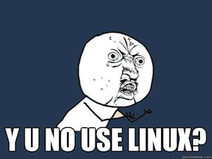

# PHP: Hypertext Preprocessor

---

# History & Numbers

* Created by Rasmus Lerdorf
* 6th language in the world (TIOBE December 2013)
* 1st language for web development
* Running on 75% of all web servers

---

# Getting Started

## Linux

    !bash
    $ sudo apt-get install php5-common libapache2-mod-php5 php5-cli

> [http://php.net/manual/en/install.unix.debian.php](http://php.net/manual/en/install.unix.debian.php)

---

# Getting Started

## Mac OS X

    !bash
    $ curl -s http://php-osx.liip.ch/install.sh | bash -s 5.5

> [http://php-osx.liip.ch/](http://php-osx.liip.ch/)

---

# Getting Started

## Windows

> [http://www.php.net/manual/en/install.windows.installer.msi.php](http://www.php.net/manual/en/install.windows.installer.msi.php)

---

# RTFM: [http://www.php.net](http://www.php.net)
