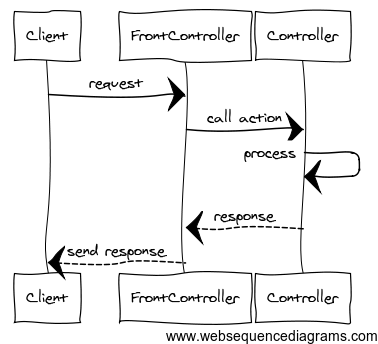
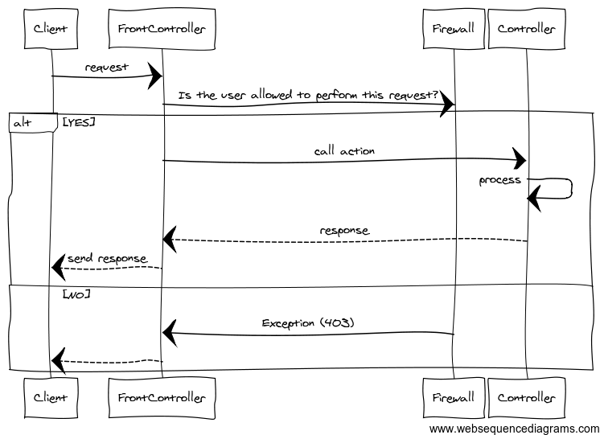
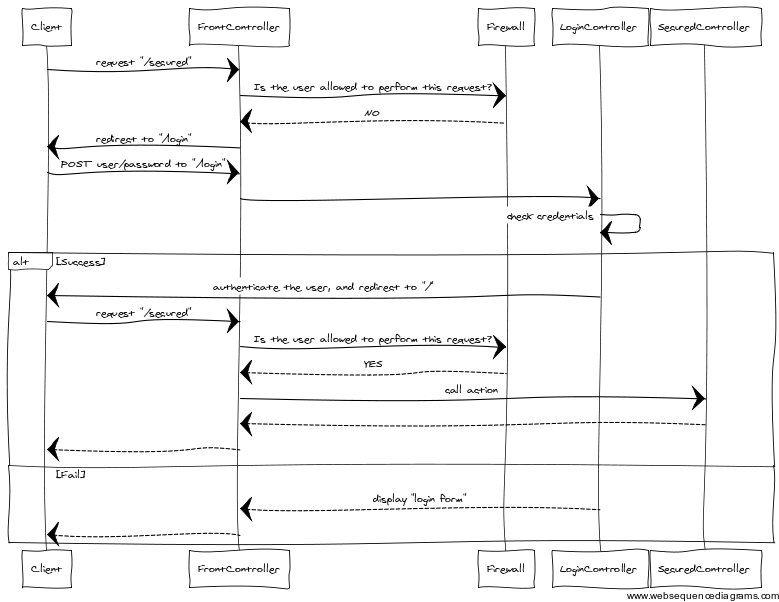

# Authentication

---

# What You Have Right Now

No **Authentication**/**Security Layer**, anyone can access everything:

---

# The Big Picture

---

# The Interceptor Pattern

The **Security Layer**, as seen before, has to **intercept** the process of
converting a request into a response in order to perform some checks.

We need a way to hook into this process before invoking the controller:
**Interceptor Pattern** to the rescue!

The **Interceptor Pattern** allows you to execute some code during the default
application's lifecyle.

A way to implement this pattern is to use **events**. It's more or less like
the **Observer**/**Observable** pattern.

### Event Dispatcher

The application notifies a set of listeners to an event.

The listeners can register themselves to a particular event.

An **Event Dispatcher** manages both the listeners, and the events.

---

# Introducing the Event Dispatcher

Using a **trait**:

    !php
    trait EventDispatcherTrait
    {
        private $events = [];

        public function addListener($name, $callable)
        {
            $this->events[$name][] = $callable;
        }

        public function dispatch($name, array $arguments = [])
        {
            foreach ($this->events[$name] as $callable) {
                call_user_func_array($callable, $arguments);
            }
        }
    }

---

# Using the EventDispatcherTrait

In order to intercept the process described before, we have to **notify** some
listeners once we enter in the `process()` method by **dispatching** the event:

    !php
    class App
    {
        use EventDispatcherTrait;

        ...

        private function process(Request $request, Route $route)
        {
            $this->dispatch('process.before', [ $request ]);

            ...
        }
    }

The **listeners** have to listen to this event:

    !php
    $app->addListener('process.before', function (Request $request) {
        // code to execute
    });

---

# The Firewall

Now that we can hook into the appplication's lifecycle, we need to write a
**Firewall**.

A **Firewall** needs a **whitelist** of unsecured routes (routes which don't
require the user to be authenticated):

    !php
    $allowed = [
        '/login'     => [ Request::GET, Request::POST ],
        '/locations' => [ Request::GET ],
    ];

The **Firewall** leverages the **session** to determine whether the user is
authenticated:

    !php
    session_start();

    if (isset($_SESSION['is_authenticated'])
        && true === $_SESSION['is_authenticated']) {
        return;
    }

If authentication fails, the server should return a `401` status code.

---

# Implementing The Firewall

    !php
    $app->addListener('process.before', function(Request $req) use ($app) {
        session_start();

        $allowed = [
            '/login' => [ Request::GET, Request::POST ],
        ];

        if (isset($_SESSION['is_authenticated'])
            && true === $_SESSION['is_authenticated']) {
            return;
        }

        foreach ($allowed as $pattern => $methods) {
            if (preg_match(sprintf('#^%s$#', $pattern), $req->getUri())
                && in_array($req->getMethod(), $methods)) {
                return;
            }
        }

        switch ($req->guessBestFormat()) {
            case 'json':
                throw new HttpException(401);
        }

        return $app->redirect('/login');
    });

---

# Authentication Mechanism

---

# Adding New Routes

    !php
    $app->get('/login', function () use ($app) {
        return $app->render('login.php');
    });

    $app->post('/login', function (Request $request) use ($app) {
        $user = $request->getParameter('user');
        $pass = $request->getParameter('password');

        if ('will' === $user && 'will' === $pass) {
            $_SESSION['is_authenticated'] = true;

            return $app->redirect('/');
        }

        return $app->render('login.php', [ 'user' => $user ]);
    });

    $app->get('/logout', function (Request $request) use ($app) {
        session_destroy();

        return $app->redirect('/');
    });

---

# Stateless Authentication

Useful for API authentication.

### OAuth

[http://oauth.net/](http://oauth.net/)

### Basic and Digest Access Authentication

[http://pretty-rfc.herokuapp.com/RFC2617](http://pretty-rfc.herokuapp.com/RFC2617)

### WSSE Username Token

[http://www.xml.com/pub/a/2003/12/17/dive.html](http://www.xml.com/pub/a/2003/12/17/dive.html)
