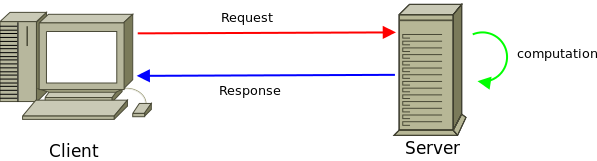
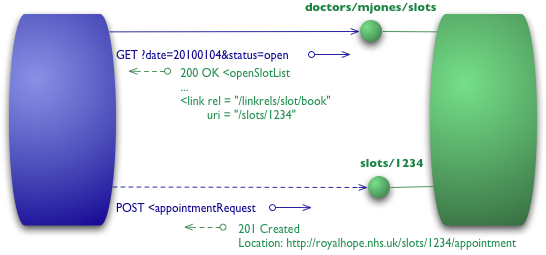

# Client/Server

---

# Client/Server Basics

A typical **client/server** request follows this pattern:

1. **Client**: Hello _server_, give me the _resource_ at _URI_;
2. **Server**: Here is the resource at _URI_:

    `Content`

For HTTP, a typical client is a **web browser**, and a server is a **web
server**.

---

# Unified Resource Identifier (URI)

### In A Nutshell

* URIs identify resources;
* URIs are format independent;
* URI "file extensions" != RESTful.

### Resources

* `/bananas/joe`: _URI_ for banana "Joe"
* `/bananas/henry`: _URI_ for banana "Henry"

### Collections

* `/bananas`: collection of all available bananas

---

# HTTP Request

Request is made of:

* A **Unique Resource Identifier** (URI);
* An **HTTP verb** (method) describing the action;
* Some **headers** describing requirements;
* A **request body** to send data.

Here is an example:

    !http
    GET /my/simple/uri?with-query-string HTTP/1.1
    Host: example.org
    Content-Type: text/plain; charset=utf-8
    Content-Length: 17

    This is a content

---

# HTTP Verbs

An HTTP verb is an action to perform on a **resource** located at a given
**URI**:

* `GET`: retrieve a **resource** or a **collection of resources**;
* `POST`: create a new **resource**;
* `PUT`: update an existing **resource** _or_ create a new **resource** at a
  given URI;
* `DELETE`: delete a given **resource**;
* `PATCH`: partial update of a given **resource**.

**Important:** this list is not exhaustive.

---

# HTTP Response

Response is made of:

* Some **headers** to describe the content;
* The response's **status code**;
* The **content** of the response;

Here is an example:

    !http
    HTTP/1.1 200 OK
    Content-Type: text/html; charset=utf-8
    Content-Length: 76

    <!DOCTYPE HTML>
    <html>
        <head>
        </head>
        <body>
            <h1>Hello world !</h1>
        </body>
    </html>

---

# Status Codes (1/2)

### `1xx` Informational

### `2xx` Successful

* `200` OK
* `201` Created
* `204` No Content

### `3xx` Redirections

* `301` Moved Permanently
* `302` Found
* `304` Not Modified

> [httpstatus.es](http://httpstatus.es/)

---

# Status Codes (2/2)

### `4xx` Client Error

* `400` Bad Request
* `401` Unauthorized
* `403` Forbidden
* `404` Not Found
* `405` Method Not Allowed
* `406` Not Acceptable
* `409` Conflict
* `415` Unsupported Media Type

### `5xx` Server Error

* `500` Internal Server Error

---

# HTTP Parameters (1/2)

There are two types of parameters, **query string** and **request body**.

If the request follows the **URL Form Encoded** format, you can access
parameters through global variables:

* **query string**: `$_GET`;
* **request body**: `$_POST`;
* All parameters are available in the `$_REQUEST` global variable.

You can always use the following, but you need to parse them by yourself:

* **query string**: `$_SERVER['QUERY_STRING']`;
* **request body**: `$HTTP_RAW_POST_DATA`
  ([deprecated](https://github.com/php/php-src/blob/8648f76bac2f78391a1539253f21d62f53d83022/NEWS#L19-L22),
  do not use).

**Note**: Don't use `$_REQUEST`, as there is a collision risk!

---

# HTTP Parameters (2/2)

    !http
    GET /my/simple/uri?a=1&id=2 HTTP/1.1
    Host: example.org
    Content-Type: text/plain; charset=utf-8
    Content-Length: 14

    b=3&city=paris

Will result in:

    !php
    $_GET     = [ "a" => 1, "id" => 2 ];

    $_POST    = [ "b" => 3, "city" => 'paris' ];

    $_REQUEST = [ "a" => 1, "id" => 2, "b" => 3, "city" => 'paris' ];

    $_SERVER['QUERY_STRING'] = "a=1&id=2";

    $HTTP_RAW_POST_DATA      = "b=3&city=paris";

**Important:** **never trust user input**, **never!**

---

# REST

---

# REpresentational State Transfer

REST is the underlying architectural principle of the web, formalized as a set
of **constraints**, described in Roy Fielding's dissertation.

An API (i.e. a web service) that adheres to the principles of REST does not
require the client to know anything about the structure of this API.
Rather, the server needs to provide whatever information the client needs to
interact with the service.

The key abstraction of information in REST is a **resource**. Any information
that can be named can be a resource, and is identified by a **Unified Resource
Identifier** (URI).

<blockquote class="info">
    
It heavily relies on the HTTP protocol: <a href="http://www.ietf.org/rfc/rfc2616.txt">RFC 2616</a>.

</blockquote>

---

# Richardson Maturity Model

 
 

---

# Level 0 - The Swamp of POX

### In A Nutshell

* HTTP as a tunneling mechanism;
* RPC style system (SOAP, XML-RPC).

 
 

---

# Level 1 - Resources

### In A Nutshell

* Individual resources (URIs);
* Notion of object identity.

 
 

---

# Level 2 - HTTP Verbs

### In A Nutshell

* Client uses specific HTTP verbs;
* Server uses HTTP status codes.

 
 

---

# Level 3 - Hypermedia Controls

### In A Nutshell

* Service discovery via link relations
* Hypermedia formats

 

---

# Level 3 = Content Negotiation + HATEOAS

---

# Media Types

### In A Nutshell

* Identifies a representation format;
* Custom types use `application/vnd.[XYZ]`;
* Used inside the `Accept` / `Content-Type` headers.

<table>
    <thead>
        <tr>
            <th>Header</th>
            <th>Description</th>
        </tr>
    </thead>
    <tbody>
        <tr><td>`Content-Type`</td><td>HTTP message format</td></tr>
        <tr><td>`Accept`</td><td>HTTP response format preference</td></tr>
    </tbody>
</table>

### Hyper Media Types

Hyper Media Types are MIME media types that contain **native hyper-linking
semantics** that induce application flow: `application/hal+json`,
`application/collection+json`, etc.

---

# Content Type Negotiation

Content Type Negotiation is the principle of finding appropriate response
formats based on client requirements.

No standardized algorithm available, even if the Apache
[mod_negotiation](http://httpd.apache.org/docs/2.4/content-negotiation.html)
algorithm is documented. This also covers encoding (`Accept-Encoding`) and
language (`Accept-Language`) negotiation.

    !text
    Accept: application/json, application/xml;q=0.9, text/html;q=0.8,
        text/*;q=0.7, */*;q=0.5

<table>
    <thead>
        <th>Priority</th>
        <th>Mime Type</th>
    </thead>
    <tbody>
        <tr><td>`q=1.0`</td><td>`application/json`</td></tr>
        <tr><td>`q=0.9`</td><td>`application/xml`</td></tr>
        <tr><td>`q=0.8`</td><td>`text/html`</td></tr>
        <tr><td>`q=0.7`</td><td>`text/*` (ie. any text)</td></tr>
        <tr><td>`q=0.5`</td><td>`*/*` (ie. any media type)</td></tr>
    </tbody>
</table>

---

# HATEOAS

**HATEOAS** stands for **H**ypermedia **A**s **T**he **E**ngine **O**f
**A**pplication **S**tate. It means that hypertext should be used to find your
way through the API.

It is all about **state transitions**. Your application is just a big **state
machine**.
There should be a single endpoint for the resource, and **all of the other
actions** you would need to undertake **should be able to be discovered by
inspecting that resource**.

    !xml
    <?xml version="1.0" encoding="UTF-8"?>
    <collection page="1" limit="10" pages="1">
        <user id="123"></user>
        <user id="456"></user>

        <link rel="self" href="/api/users?page=1&amp;limit=10" />
        <link rel="first" href="/api/users?page=1&amp;limit=10" />
        <link rel="last" href="/api/users?page=1&amp;limit=10" />
    </collection>

> Must read: [Haters gonna
HATEOAS](http://timelessrepo.com/haters-gonna-hateoas).
