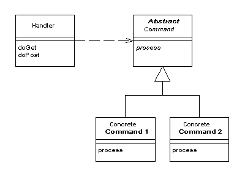

# Model View Controller
---

# MVC Overview

Typical client request process in MVC architecture:

---

# The Model

**Model** is the layer in charge of data interaction.

All **data related business logic** is embedded here.
Using it should not require to understand internals.

Examples:

* Manipulate **database** records;
* Communicate with **search engine**;
* **API** calls;
* etc.

<blockquote class="no-before-icon more-on-this-next-week">
    <i class="fa fa-bullhorn"></i>
    
More on this next week!

</blockquote>

<blockquote class="no-before-icon more-on-this-later">
    <i class="fa fa-bullhorn"></i>
    
More on this in a few minutes!

</blockquote>

---

# The View

PHP is a templating language per se.

**Never**, **ever**, **ever** mix HTML and PHP codes or kittens
will die: you have to separate the presentation from the business logic.

    !php
    class PhpTemplateEngine implements TemplateEngine
    {
        private $templateDir;

        public function __construct($templateDir)
        {
            $this->templateDir = $templateDir;
        }

        public function render($template, array $parameters = [])
        {
            extract($parameters);

            ob_start();
            include $this->templateDir . DIRECTORY_SEPARATOR . $template;

            return ob_get_clean();
        }
    }

---

# The View

### Template

    !html
    <!-- my_template.html -->
    
Hello, <?php echo $name; ?>!

Even better with PHP 5.4+:

    !html
    
Hello, <?= $name ?>!

### Usage

    !php
    $engine = new PhpTemplateEngine('/path/to/templates');

    echo $engine->render('my_template.html', [
        'name' => 'World',
    ]);
    => 
Hello, World!

---

# The View

**Twig** is a modern template engine for PHP. It takes care of escaping for
you and much much more! Read more:
[http://twig.sensiolabs.org/](http://twig.sensiolabs.org/).

### Template

    !html+django
    {# my_template.html #}
    
Hello, {{ name }}!

### Usage

    !php
    $loader = new Twig_Loader_Filesystem('/path/to/templates');
    $engine = new Twig_Environment($loader, [
        'cache' => '/path/to/compilation_cache',
    ]);

    echo $engine->render('my_template.html', [
        'name' => 'World',
    ]);
    => 
Hello, World!

---

# The Controller

**Glue** between the **Model** and the **View** layers.

It **should not** contain any business logic.

    !php
    class BananaController
    {
        public function __construct(
            BananaRepository $repository,
            TemplateEngine $engine
        ) {
            $this->repository = $repository;
            $this->engine     = $engine;
        }

        public function listAction()
        {
            $bananas = $this->repository->findAll();

            return $this->engine->render('list.html', [
                'bananas' => $bananas,
            ]);
        }
    }

---

# Routing

Routing is the process of binding `URI`s to controllers.

## Folder organization

The simplest kind of routing, but also the hardest one to maintain:

    !text
    web/
    ├ trees/
    │ └ pineapple.php
    └ tree.php

## Centralized Declaration

Modern frameworks provide a routing component such as the **Symfony2 Routing**
component allowing to define routes in a centralized place, and easing `URI`
generation.

This require a single entry point: the **Front Controller**.

---

# Front Controller Pattern

A controller that handles all requests for a web application:

This controller dispatches the request to the **specialized controllers**.

It is usually tied to URL rewriting.
