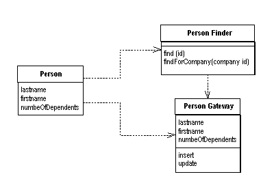
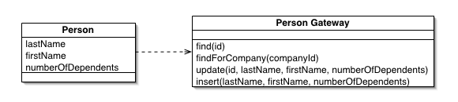
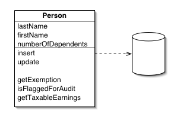
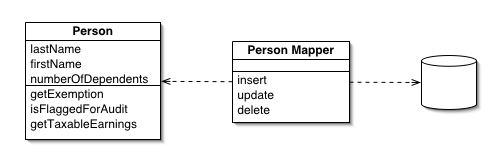
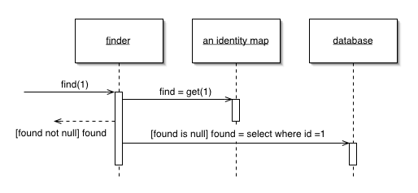
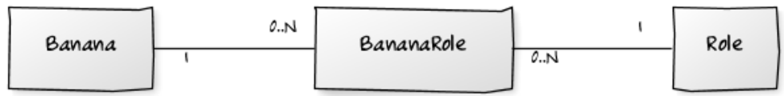
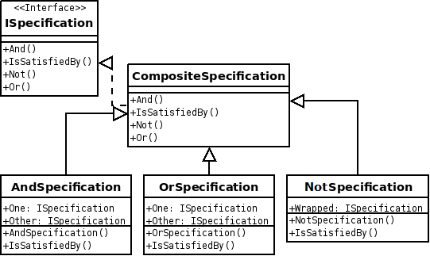

# Databases

---

# Agenda

* Database Design Patterns
* Data Access Layer
* Object Relational Mapping
* Existing Components
* A Note About Domain-Driven Design

---

# Quick note

In our context, a **database** is seen as a server hosting:

* a set of `records`;
* organised through `tables` or `collections`;
* grouped by `databases`.

---

# Database Design Patterns

* Row Data Gateway
* Table Data Gateway
* Active Record
* Data Mapper
* Identity Map
* etc.

Definitions and figures are part of the [Catalog of Patterns of Enterprise
Application Architecture](http://martinfowler.com/eaaCatalog/index.html)
created by **Martin Fowler**.

Don't forget his name! Read his books!

---

# Row Data Gateway 

---

# Row Data Gateway

An object that acts as a Gateway to a single record (row) in a database.
There is one instance per row.

    !php
    // This is the implementation of `BananaGateway`
    class Banana
    {
        private $id;

        private $name;

        public function getId()
        {
            return $this->id;
        }

        public function getName()
        {
            return $this->name;
        }

        public function setName($name)
        {
            $this->name = $name;
        }
    }

---

# Row Data Gateway

### Usage

    !php
    $con = new Connection('...');

    $banana = new Banana();
    $banana->setName('Super Banana');

    // Save the banana
    $banana->insert($con);

    // Update it
    $banana->setName('New name for my banana');
    $banana->update($con);

    // Delete it
    $banana->delete($con);

---

# Row Data Gateway

### Under the hood

    !php
    public function insert(Connection $con)
    {
        // Prepared statement
        $stmt = $this->con->prepare('INSERT INTO bananas VALUES (:name)');

        $stmt->bindValue(':name', $name);

        $stmt->execute();

        // Set the id for this banana
        //
        // It becomes easy to know whether the banana is new or not,
        // you just need to check if id is defined.
        $this->id = $this->con->lastInsertId();
    }

---

# Table Data Gateway 

---

# Table Data Gateway

An object that acts as a _Gateway_ to a database table.
One instance handles all the rows in the table.

It's a **D**ata **A**ccess **O**bject.

    !php
    $table = new BananaGateway(new Connection('...'));

    // Insert a new record
    $id = $table->insert('My favorite banana');

    // Update it
    $table->update($id, 'THE banana');

    // Delete it
    $table->delete($id);

### CRUD

A DAO implements the well-known **C**reate **R**ead **U**pdate
**D**elete methods.

**R**ead should not be a single method: **Finders** to the rescue!

---

# Table Data Gateway

### Implementation

    !php
    class BananaGateway
    {
        private $con;

        public function __construct(Connection $con)
        {
            $this->con = $con;
        }

        public function insert($name) {}

        public function update($id, $name) {}

        public function delete($id);
    }

---

# Table Data Gateway

### The insert method

    !php
    /**
     * @param string $name The name of the banana you want to create
     *
     * @return int The id of the banana
     */
    public function insert($name)
    {
        // Prepared statement
        $stmt = $this->con->prepare('INSERT INTO bananas VALUES (:name)');

        $stmt->bindValue(':name', $name);

        $stmt->execute();

        return $this->con->lastInsertId();
    }

---

# Table Data Gateway

### The update method

    !php
    /**
     * @param int    $id   The id of the banana to update
     * @param string $name The new name of the banana
     *
     * @return bool Returns `true` on success, `false` otherwise
     */
    public function update($id, $name)
    {
        $stmt = $this->con->prepare(<<<SQL
    UPDATE bananas
    SET name = :name
    WHERE id = :id
    SQL
        );

        $stmt->bindValue(':id', $id);
        $stmt->bindValue(':name', $name);

        return $stmt->execute();
    }

---

# Table Data Gateway

### The delete method

    !php
    /**
     * @param int $id The id of the banana to delete
     *
     * @return bool Returns `true` on success, `false` otherwise
     */
    public function delete($id)
    {
        $stmt = $this->con->prepare('DELETE FROM bananas WHERE id = :id');

        $stmt->bindValue(':id', $id);

        return $stmt->execute();
    }

---

# Table Data Gateway

### Finders

    !php
    // Retrieve all bananas
    $bananas = $table->findAll();

    // Find bananas by name matching 'THE %'
    $bananas = $table->findByName('THE %');

    // Retrieve a given banana using its id
    $banana = $table->find(123);

    // Find one banana by name matching 'THE %'
    $banana = $table->findOneByName('THE %');

> Use the `__call()` magic method to create magic finders:
[http://www.php.net/manual/en/language.oop5.overloading.php#object.call](http://www.php.net/manual/en/language.oop5.overloading.php#object.call).

---

# Active Record 

---

# Active Record

An object that wraps a row in a database table, encapsulates
the database access, and adds domain logic on that data.

## Active Record = Row Data Gateway + Domain Logic

    !php
    $con = new Connection('...');

    $banana = new Banana();
    $banana->setName('Another banana');
    $banana->save($con);

    // Call a method that is part of the domain logic
    // What can a banana do anyway?
    $banana->grow();

    // Smart `save()` method
    // use `isNew()` under the hood
    $banana->save($con);

---

# Active Record

    !php
    class Banana
    {
        private $height = 1;

        public function grow()
        {
            $this->height++;
        }

        public function save(Connection $con)
        {
            if ($this->isNew()) {
                // issue an INSERT query
            } else {
                // issue an UPDATE query
            }
        }

        public function isNew()
        {
            // Yoda style
            return null === $this->id;
        }
    }

---

# Data Mapper 

---

# Data Mapper

A layer of Mappers that moves data between objects and a database
while keeping them independent of each other and the mapper itself.

Sort of _"Man in the Middle"_.

    !php
    class BananaMapper
    {
        private $con;

        public function __construct(Connection $con)
        {
            $this->con = $con;
        }

        public function persist(Banana $banana)
        {
            // code to save the banana
        }

        public function remove(Banana $banana)
        {
            // code to delete the banana
        }
    }

---

# Data Mapper

### Usage

    !php
    $banana = new Banana();
    $banana->setName('Fantastic Banana');

    $con    = new Connection('...');
    $mapper = new BananaMapper($con);

### Persist = Save or Update

    !php
    $mapper->persist($banana);

### Remove

    !php
    $mapper->remove($banana);

---

# Identity Map 

---

# Identity Map

Ensures that each object gets loaded only once by keeping every loaded object in
a map. Looks up objects using the map when referring to them.

    !php
    class Finder
    {
        private $identityMap = [];

        public function find($id)
        {
            if (!isset($this->identityMap[$id])) {
                // fetch the object for the given id
                $this->identityMap[$id] = ...;
            }

            return $this->identityMap[$id];
        }
    }

---

# Data Access Layer

---

# Data Access Layer / Data Source Name

A **D**ata **A**ccess **L**ayer (DAL) is a standard API to manipulate data,
no matter which database server is used.
A **D**ata **S**ource **N**ame (DSN) can be used to determine which database
vendor you are using.

### PHP Data Object (PDO)

A DSN in PHP looks like: `<database>:host=<host>;dbname=<dbname>` where:

* `<database>` can be: `mysql`, `sqlite`, `pgsql`, etc;
* `<host>` is the IP address of the database server (e.g. `localhost`);
* `<dbname>` is your database name.

> [http://www.php.net/manual/en/intro.pdo.php](http://www.php.net/manual/en/intro.pdo.php)

---

# Data Access Layer

### PDO usage

    !php
    $dsn = 'mysql:host=localhost;dbname=test';

    $con = new PDO($dsn, $user, $password);

    // Prepared statement
    $stmt = $con->prepare($query);
    $stmt->execute();

Looks like the `Connection` class you used before, right?

    !php
    class Connection extends PDO
    {
    }

### Usage

    !php
    $con = new Connection($dsn, $user, $password);

---

# Data Access Layer

### Refactoring

Refactoring is a disciplined technique for restructuring an existing
body of code, altering its internal structure without changing its
external behavior.

    !php
    class Connection extends PDO
    {
        /**
         * @param string $query
         * @param array  $parameters
         *
         * @return bool Returns `true` on success, `false` otherwise
         */
        public function executeQuery($query, array $parameters = [])
        {
            $stmt = $this->prepare($query);

            foreach ($parameters as $name => $value) {
                $stmt->bindValue(':' . $name, $value);
            }

            return $stmt->execute();
        }
    }

---

# Data Access Layer

### Usage

    !php
    /**
     * @param int    $id   The id of the banana to update
     * @param string $name The new name of the banana
     *
     * @return bool Returns `true` on success, `false` otherwise
     */
    public function update($id, $name)
    {
        $query = 'UPDATE bananas SET name = :name WHERE id = :id';

        return $this->con->executeQuery($query, [
            'id'    => $id,
            'name'  => $name,
        ]);
    }

---

# Object Relational Mapping

---

# Object Relational Mapping (1/4)

Introduces the notion of **relations** between objects:

* One-To-One;
* One-To-Many;
* Many-To-Many.

An **ORM** is often considered as a _tool_ that implements some design patterns
seen above, and that eases relationships between objects.

---

# Object Relational Mapping (2/4)

### One-To-One (1-1)

### Code Snippet

    !php
    $profile = $banana->getProfile();

.fx: no-border

---

# Object Relational Mapping (3/4)

### One-To-Many (1-N)

### Code Snippet

    !php
    $bananas = $bananaTree->getBananas();

.fx: no-border

---

# Object Relational Mapping (4/4)

### Many-To-Many (N-N)

### Code Snippet

    !php
    $roles = [];
    foreach ($banana->getBananaRoles() as $bananaRole) {
        $roles[] = $bananaRole->getRole();
    }

    // Or, better:
    $roles = $banana->getRoles();

.fx: no-border

---

# Existing Components

### Propel ORM

An ORM that implements the **Table Data Gateway** and **Row Data Gateway**
patterns, often seen as an **Active Record** approach.

> Documentation: [www.propelorm.org](http://www.propelorm.org).

### Doctrine2 ORM

An ORM that implements the **Data Mapper** pattern.

> Documentation: [www.doctrine-project.org](http://www.doctrine-project.org/).

---

# A Note About Domain-Driven Design

---

# Entities

An object defined primarily by its identity is called an **entity**:

    !php
    class Customer
    {
        private $id;

        private $name;

        public function __construct($id, Name $name)
        {
            $this->id   = $id;
            $this->name = $name;
        }

        public function getId()
        {
            return $this->id;
        }

        public function getName()
        {
            return $this->name;
        }
    }

---

# Value Objects

An object that represents a descriptive aspect of the domain with no conceptual
identity is called a **Value Object**:

    !php
    class Name
    {
        private $firstName;

        private $lastName;

        public function __construct($firstName, $lastName)
        {
            $this->firstName = $firstName;
            $this->lastName  = $lastName;
        }

        public function getFirstName()
        {
            return $this->firstName;
        }

        public function getLastName()
        {
            return $this->lastName;
        }
    }

---

# The Repository Pattern 

---

# The Repository Pattern

A Repository **mediates between the domain and data mapping layers**, acting
like an **in-memory domain object collection**.

    !php
    interface CustomerRepository
    {
        /**
         * @return Customer
         */
        public function find($customerId);

        /**
         * @return Customer[]
         */
        public function findAll();

        public function add(Customer $user);

        public function remove(Customer $user);
    }

---

# The Repository Pattern

Client objects construct **query specifications** declaratively and submit them
to Repository for satisfaction.

**Objects can be added to and removed** from the Repository, **as they can from
a simple collection of objects**, and the mapping code encapsulated by the
Repository will carry out the appropriate operations behind the scenes.

Conceptually, a Repository encapsulates the set of objects persisted in a data
store and the operations performed over them, providing a more object-oriented
view of the persistence layer.

Repository also supports the objective of achieving a **clean separation and
one-way dependency between the domain and data mapping layers**.

---

# The Specification Pattern 

---

# The Specification Pattern

The Specification pattern is a way to model business rules as individual
objects. The idea is that a question about an object, is answered by a
`isSatisfiedBy()` method:

    !php
    interface CustomerSpecification
    {
        /**
         * @return boolean
         */
        public function isSatisfiedBy(Customer $customer);
    }

    !php
    class CustomerIsPremium implements CustomerSpecification
    {
        /**
         * {@inheritDoc}
         */
        public function isSatisfiedBy(Customer $customer)
        {
            // figure out if the customer is indeed premium,
            // and return true or false.
        }
    }

---

# Repository &hearts; Specification

A `findSatisfying()` method can be added to the `CustomerRepository`:

    !php
    interface CustomerRepository
    {
        ...

        /**
         * @return Customer[]
         */
        public function findSatisfying(CustomerSpecification $specification);
    }

### Usage

    !php
    $specification = new CustomerIsPremium();
    $customers     = $repository->findSatisfying($specification);

---

# Combine Them!

    !php
    class OrSpecification implements CustomerSpecification
    {
        public function __construct(
            CustomerSpecification $s1,
            CustomerSpecification $s2
        ) {
            $this->s1 = $s1;
            $this->s2 = $s2;
        }

        public function isSatisfiedBy(Customer $c)
        {
            return $this->s1->isSatisfiedBy($c) || $this->s2->isSatisfiedBy($c);
        }
    }

    !php
    class AndSpecification implements CustomerSpecification
    {
        ...

        public function isSatisfiedBy(Customer $c)
        {
            return $this->s1->isSatisfiedBy($c) && $this->s2->isSatisfiedBy($c);
        }
    }

---

# Combine Them!

    !php
    class NotSpecification implements CustomerSpecification
    {
        public function __construct(CustomerSpecification $s)
        {
            $this->s = $s;
        }

        public function isSatisfiedBy(Customer $c)
        {
            return !$this->s->isSatisfiedBy($c);
        }
    }

### Usage

    !php
    // Find customers who have ordered exactly three times,
    // but who are not premium customers (yet?)
    $specification = new AndSpecification(
        new CustomerHasOrderedThreeTimes(),
        new NotSpecification(
            new CustomerIsPremium()
        )
    );

    $customers = $repository->findSatisfying($specification);

---

# Specification For Business Rules

Reuse your specifications in your business layer:

    !php
    class AwesomeOfferSender
    {
        private $specification;

        public function __construct(CustomerIsPremium $specification)
        {
            $this->specification = $specification;
        }

        public function sendOffersTo(Customer $customer)
        {
            if ($this->specification->isSatisfiedBy($customer)) {
                // send offers
            }
        }
    }
