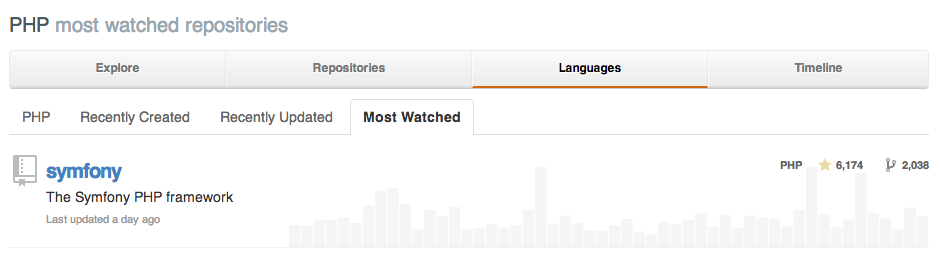

# 

.fx: no-border

---

# What Is Symfony?

First of all:

<blockquote class="quote">
    
Symfony is a <strong>reusable</strong> set of standalone, decoupled, and cohesive PHP
    <strong>components</strong> that solve common web development problems.

</blockquote>

Then, based on these components:

<blockquote class="quote">
    
Symfony is also a <strong>full-stack web framework</strong>.

</blockquote>

_Fabien Potencier,
[http://fabien.potencier.org/article/49/what-is-symfony2](http://fabien.potencier.org/article/49/what-is-symfony2)._

---

# Is Symfony A MVC Framework?

---

# NO!

.fx: color-red

---

# Why You Should Use Symfony

Symfony is built on powerful concepts:

* **Separation of Concerns**;
* **Pragmatism**;
* **Best Practices**.

It has been written by [~1290 developers](http://symfony.com/contributors/code).

Open Source, **MIT** licensed.

---

# The Symfony Components

The Components implement **common features** needed to develop websites.

They are the **foundation of the Symfony full-stack framework**, but they can
also be used **standalone** even if you don't use the framework as they don't
have any mandatory dependencies.

There are ~30 components, including:

    !text
    BrowserKit              EventDispatcher     OptionsResolver     Translation
    ClassLoader             ExpressionLanguage  Process             VarDumper
    Config                  Filesystem          PropertyAccess      Yaml
    Console                 Finder              Routing
    CssSelector             Form                Security
    Debug                   HttpFoundation      Serializer
    DependencyInjection     HttpKernel          Stopwatch
    DomCrawler              Intl                Templating

---

# Getting Ready With Components

Say you want to play with YAML files, start by requiring the `symfony/yaml`
component into your `composer.json` file:

    !yaml
    {
        "require": {
            "symfony/yaml": "~2.6"
        }
    }

Install it by running `php composer.phar install`, and use it:

    !php
    require __DIR__ . '/vendor/autoload.php';

    use Symfony\Component\Yaml\Yaml;

    $yaml = Yaml::parse('/path/to/file.yml');

> [http://symfony.com/doc/current/components/yaml/introduction.html](http://symfony.com/doc/current/components/yaml/introduction.html)

---

# Full-Stack Framework

The **Symfony Framework** accomplishes two distinct tasks:

* Provides a selection of components;
* Provides sensible configuration and a "glue" library that ties all of these
  pieces together.

The goal of the framework is **to integrate many independent tools** in order to
provide a consistent experience for the developer. Even **the framework itself is
a Symfony bundle** (i.e. a plugin) that can be configured or replaced entirely.

Symfony **provides a powerful set of tools for rapidly developing web
applications** without imposing on your application.

> [http://symfony.com/doc/current/book/index.html](http://symfony.com/doc/current/book/index.html)

---

# Overall Architecture

---

# The Symfony Request

    !php
    use Symfony\Component\HttpFoundation\Request;

    $request = Request::createFromGlobals();

    // the URI being requested (e.g. /about) minus any query parameters
    $request->getPathInfo();

    // the HTTP verb
    $request->getMethod();

    // GET variables
    $request->query->get('foo');

    // POST variables
    $request->request->get('bar');

    // SERVER variables
    $request->server->get('HTTP_HOST');

    // retrieve an HTTP request header, with normalized, lowercase keys
    $request->headers->get('host');

---

# The Symfony Response

    !php
    use Symfony\Component\HttpFoundation\Response;

    $response = new Response();

    $response->setContent(<<<HTML
    <html>
        <body>
            <h1>Hello world!</h1>
        </body>
    </html>
    HTML
    );

    $response->setStatusCode(200);

    $response->headers->set('Content-Type', 'text/html');

    // prints the HTTP headers followed by the content
    $response->send();

---

# The Simplest Front Controller Ever

    !php
    // index.php
    use Symfony\Component\HttpFoundation\Request;
    use Symfony\Component\HttpFoundation\Response;

    $request = Request::createFromGlobals();
    $path    = $request->getPathInfo();

    if (in_array($path, array('', '/'))) {
        $response = new Response('Welcome to the homepage.');
    } elseif ('/hello' === $path) {
        $response = new Response('hello, World!');
    } else {
        $response = new Response('Page not found.', 404);
    }

    $response->send();

---

# The Symfony Application Flow

It's all about transforming a **Request** into a **Response**:
  

---

# Routing Definition

The routing system determines which PHP function should be executed based on
information from the request and routing configuration you've created.

    !yaml
    # app/config/routing.yml
    hello:
        pattern:  /hello
        defaults: { _controller: AcmeDemoBundle:Main:hello }

The `AcmeDemoBundle:Main:hello` string is a short syntax that points to a
specific PHP method named `helloAction()` inside a class called
`MainController`.

<blockquote class="info">
    

        This example uses <strong>YAML</strong> to define the routing configuration.
        Routing configuration can also be written in other formats such as <strong>XML</strong> or <strong>PHP</strong>.
    

</blockquote>

---

# Your First Controller

In Symfony, a method in a controller is called an **action**. The convention is
to suffix each method with `Action`.

Also, each controller should be suffixed with `Controller`.

    !php
    // src/Acme/DemoBundle/Controller/MainController.php
    namespace Acme\DemoBundle\Controller;

    use Symfony\Component\HttpFoundation\Response;

    class MainController
    {
        public function helloAction()
        {
            return new Response('<h1>Hello, World!</h1>');
        }
    }

---

# A Symfony Project

**Recommended** structure of a Symfony project:

    !text
    path/to/project/
        app/
            cache/
            config/
            logs/
        src/
            ...
        vendor/
            ...
        web/
            app.php
            ...

* `app/` contains the application kernel, and the configuration;
* `src/` contains your **bundles**;
* `vendor/` contains your dependencies;
* `web/` contains your front controllers and your assets.

---

# Application Kernel

This is the **central part** of your application:

    !php
    // app/AppKernel.php
    use Symfony\Component\HttpKernel\Kernel;

    class AppKernel extends Kernel
    {
        public function registerBundles()
        {
            $bundles = array(
                new Symfony\Bundle\FrameworkBundle\FrameworkBundle(),
                // ...
            );

            if (in_array($this->getEnvironment(), array('dev', 'test'))) {
                $bundles[] = // dev bundle;
            }

            return $bundles;
        }

        // ...
    }

---

# Application Configuration

An application consists of a collection of "bundles" representing all of the
features and capabilities of your application.

Each "bundle" can be customized via configuration files written in `YAML`, `XML`
or `PHP`.

By default, the main configuration file lives in the `app/config/`
directory and is called either `config.yml`, `config.xml` or `config.php`
depending on which format you prefer.

Symfony is all about configuring everything, and you can do pretty much
everything you want. That's why people agreed on some conventions, but then
again, a convention is just **A** way to do things, not **THE** way to do them.

---

# YAML Configuration

### Example:

    !yaml
    # app/config/config.yml
    imports:
        - { resource: parameters.yml }
        - { resource: security.yml }

    framework:
        secret: "%secret%"
        router: { resource: "%kernel.root_dir%/config/routing.yml" }
        # ...

    # Twig Configuration
    twig:
        debug:            "%kernel.debug%"
        strict_variables: "%kernel.debug%"

    # ...

---

# XML Configuration

### Example:

    !xml
    <!-- app/config/config.xml -->
    <imports>
        <import resource="parameters.yml"/>
        <import resource="security.yml"/>
    </imports>

    <framework:config secret="%secret%">
        <framework:router resource="%kernel.root_dir%/config/routing.xml"/>
        <!-- ... -->
    </framework:config>

    <!-- Twig Configuration -->
    <twig:config debug="%kernel.debug%" strict-variables="%kernel.debug%"/>

    <!-- ... -->

---

# PHP Configuration

### Example:

    !php
    $this->import('parameters.yml');
    $this->import('security.yml');

    $container->loadFromExtension('framework', array(
        'secret' => '%secret%',
        'router' => array(
            'resource' => '%kernel.root_dir%/config/routing.php'
        ),
        // ...
    ));

    // Twig Configuration
    $container->loadFromExtension('twig', array(
        'debug'            => '%kernel.debug%',
        'strict_variables' => '%kernel.debug%',
    ));

    // ...

---

# The Rules (Well... My Rules)

The **main configuration** MUST be written in `YAML`:

    !yaml
    # app/config/config.yml
    # ...
    twig:
        debug:            "%kernel.debug%"
        strict_variables: "%kernel.debug%"

The **routing definition** MUST be written in `YAML`:

    !yaml
    # app/config/routing.yml
    hello:
        pattern:  /hello
        defaults: { _controller: AcmeDemoBundle:Main:hello }

The **DI Container configuration** MUST be written in `XML`:

    !xml
    <services>
        <service id="acme_demo.controllers.main"
            class="Acme\DemoBundle\MainController" />
    </services>

---

# Environments

An application can run in various environments. The different environments
**share the same PHP code**, but use different configuration.

A Symfony project generally uses three environments: `dev`, `test` and `prod`.

    !php
    // web/app.php

    // ...
    $kernel = new AppKernel('prod', false);

The `AppKernel` class is responsible for actually loading the configuration file
of your choice:

    !php
    // app/AppKernel.php
    public function registerContainerConfiguration(LoaderInterface $loader)
    {
        $loader->load(
            __DIR__ . '/config/config_' . $this->getEnvironment() . '.yml'
        );
    }

---

# What Is A Bundle?

_A **Bundle** is a directory containing a set of files (PHP files, stylesheets,
JavaScripts, images, ...) that implement a **single feature** (a blog, a forum,
etc)._

It should be **reusable**, so that you don't reinvent the wheel each time you
need a common feature. In Symfony, (almost) everything lives inside a bundle.

In order to use a bundle in your application, you need to register it in the
`AppKernel`, using the `registerBundles()` method:

    !php
    public function registerBundles()
    {
        $bundles = array(
            // ...

            new My\AwesomeBundle\MyAwesomeBundle(),
        );

        // ...
    }

---

# Bundle: Directory Structure

Recommended structure for a bundle:

    !text
    XXX/...
        DemoBundle/
            DemoBundle.php
            Controller/
            Resources/
                meta/
                    LICENSE
                config/
                doc/
                    index.rst
                translations/
                views/
                public/
            Tests/

The `DemoBundle` class is mandatory, and both `Resources/meta/LICENSE` and
`Resources/doc/index.rst` files should be present.

The `XXX` directory(ies) reflects the namespace structure of the bundle.

---

# Bundle: Where To Put Your Classes?

<table>
    <colgroup>
        <col width="51%">
        <col width="49%">
    </colgroup>
    <thead valign="bottom">
        <tr>
            <th class="head">Type</th>
            <th class="head">Directory</th>
        </tr>
    </thead>
    <tbody valign="top">
        <tr>
            <td>Commands</td>
            <td><tt><code>Command/</code></tt></td>
        </tr>
        <tr>
            <td>Controllers</td>
            <td><tt><code>Controller/</code></tt></td>
        </tr>
        <tr>
            <td>Service Container Extensions</td>
            <td><tt><code>DependencyInjection/</code></tt></td>
        </tr>
        <tr>
            <td>Event Listeners</td>
            <td><tt><code>EventListener/</code></tt></td>
        </tr>
        <tr>
            <td>Configuration</td>
            <td><tt><code>Resources/config/</code></tt></td>
        </tr>
        <tr>
            <td>Web Resources</td>
            <td><tt><code>Resources/public/</code></tt></td>
        </tr>
        <tr>
            <td>Translation files</td>
            <td><tt><code>Resources/translations/</code></tt></td>
        </tr>
        <tr>
            <td>Templates</td>
            <td><tt><code>Resources/views/</code></tt></td>
        </tr>
        <tr>
            <td>Unit and Functional Tests</td>
            <td><tt><code>Tests/</code></tt></td>
        </tr>
    </tbody>
</table>

---

# Creating a Bundle

A **bundle** has to extend the `Symfony\Component\HttpKernel\Bundle\Bundle`
class:

    !php
    // src/Acme/MyFirstBundle/AcmeMyFirstBundle.php
    namespace Acme\MyFirstBundle;

    use Symfony\Component\HttpKernel\Bundle\Bundle;

    class AcmeMyFirstBundle extends Bundle
    {
    }

Then, you can register your bundle:

    !php
    // app/AppKernel.php
    public function registerBundles()
    {
        $bundles = array(
            new Acme\MyFirstBundle\AcmeMyFirstBundle(),
        );

        return $bundles;
    }

---

# The Web Directory

The web root directory is the **home of all public and static files** including
images, stylesheets, and JavaScript files. It is also where each front
controller lives:

    !php
    // web/app.php
    require_once __DIR__.'/../app/bootstrap.php.cache';
    require_once __DIR__.'/../app/AppKernel.php';

    use Symfony\Component\HttpFoundation\Request;

    $kernel   = new AppKernel('prod', false);
    $request  = Request::createFromGlobals();
    $response = $kernel->handle($request);
    $response->send();

The front controller file (`app.php` in this example) is the actual PHP file
that's executed when using a Symfony application and its job is to **use a
Kernel** class, `AppKernel`, to **bootstrap the application**, for a given
**environment**.

---

# Summary

Creating a page is a three-step process involving a _route_, a _controller_, and
(optionally) a _template_.

Each project contains just a few main directories: `web/` (web assets and the
front controllers), `app/` (configuration), `src/` (your bundles), and `vendor/`
(third-party code).

Each feature in Symfony (including the Symfony framework core) is organized
into a **bundle**, which is a structured set of files for that feature.

The configuration for each bundle lives in the `Resources/config` directory of the
bundle and can be specified in `YAML`, `XML` or `PHP`.

The global application configuration lives in the `app/config/` directory.

Each environment is accessible via a different front controller (e.g. `app.php`
and `app_dev.php`) and loads a different configuration file.

---

# Read The [Best Practices](http://symfony.com/doc/current/best_practices/index.html)!
