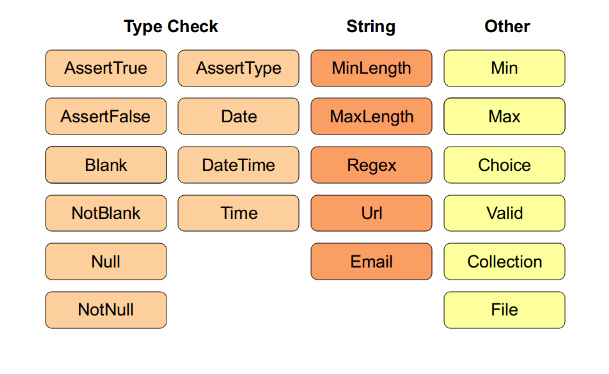

# Validation

---

# About Form Validation

In the previous section, you learned how a form can be submitted with valid or
invalid data. In Symfony, **validation is applied to the underlying object**.

In other words, the question isn't whether the "form" is valid, but whether the
object is valid after the form has applied the submitted data to it.

Calling `$form->isValid()` is a shortcut that **asks the object whether it has
valid data** using a Validation layer.

Validation is done by adding a set of rules (called **constraints**) to a class.

---

# The Validator Component

This component is based on the [JSR303 Bean Validation
specification](http://jcp.org/en/jsr/detail?id=303).

### Example

Given the following class:

    !php
    namespace Acme\DemoBundle\Entity;

    class Author
    {
        public $name;
    }

You can configure a set of **constraints** on it:

    !yaml
    # src/Acme/DemoBundle/Resources/config/validation.yml
    Acme\DemoBundle\Entity\Author:
        properties:
            name:
                - NotBlank: ~

---

# Using the `validator` Service

    !php
    $author = new Author();
    // ... do something to the $author object

    $validator = $this->get('validator');
    $errors    = $validator->validate($author);

    if (count($errors) > 0) {
        // Ooops, errors!
    } else {
        // Everything is ok :-)
    }

If the `$name` property is empty, you will see the following error message:

    !text
    Acme\DemoBundle\Author.name:
        This value should not be blank

Most of the time, you won't interact directly with the validator service or need
to worry about printing out the errors. You will rather use validation
indirectly when handling submitted form data.

---

# Constraints

> [http://symfony.com/doc/master/book/validation.html#constraints](http://symfony.com/doc/master/book/validation.html#constraints)

---

# Constraint Targets (1/2)

Constraints can be **applied to a class property** or a **public getter method**
(e.g. `getFullName()`). The first is the most common and easy to use, but the
second allows you to specify more complex validation rules.

### Properties

Validating class properties is the most basic validation technique. Symfony
**allows you to validate private, protected or public properties**.

    !yaml
    # src/Acme/DemoBundle/Resources/config/validation.yml
    Acme\DemoBundle\Entity\Author:
        properties:
            firstName:
                - NotBlank: ~

### Classes

Some constraints apply to the entire class being validated. For example, the
`Callback` constraint is a generic constraint that's applied to the class
itself.

---

# Constraint Targets (2/2)

### Getters

Constraints **can also be applied to the return value of a method**. Symfony
allows you to add a constraint to any public method whose name starts with
`get` or `is`.

    !yaml
    # src/Acme/DemoBundle/Resources/config/validation.yml
    Acme\DemoBundle\Entity\Author:
        getters:
            passwordLegal:
                - "False":
                    message: "The password cannot match your first name"

With the following code in the `Author` class:

    !php
    public function isPasswordLegal()
    {
        return ($this->firstName !== $this->password);
    }

---

# Validation Groups (1/2)

In some cases, you will **need to validate an object against only some of the
constraints on that class**.

You can organize each constraint into one or more **validation groups**, and
then apply validation against just one group of constraints.

### Example

    !yaml
    # src/Acme/DemoBundle/Resources/config/validation.yml
    Acme\DemoBundle\Entity\User:
        properties:
            email:
                - Email:    { groups: [ registration ] }
            password:
                - NotBlank: { groups: [ registration ] }
                - Length:   { groups: [ registration ], min: 7 }
            city:
                - Length:
                    min: 2

---

# Validation Groups (2/2)

With the configuration seen before, there are **two validation groups**:

* **Default**: contains the constraints not assigned to any other group;
* **registration**: contains the constraints on the email and password fields only.

To tell the validator to use a specific group, pass one or more group names as
the second argument to the `validate()` method:

    !php
    $errors = $validator->validate($author, [ 'registration' ]);

---

# Using Validation Groups In Forms

If your object takes advantage of validation groups, you'll need to specify
which validation group(s) your form should use:

    !php
    $form = $this
        ->createFormBuilder($users, [
            'validation_groups' => [ 'registration' ],
        ])
        ->add(...);

If you're creating **form classes**, then you'll need to add the following to
the `setDefaultOptions()` method:

    !php
    use Symfony\Component\OptionsResolver\OptionsResolverInterface;

    public function setDefaultOptions(OptionsResolverInterface $resolver)
    {
        $resolver->setDefaults([
            'validation_groups' => [ 'registration' ],
        ]);
    }

---

# Validating Values and Arrays

    !php
    use Symfony\Component\Validator\Constraints\Email;

    $emailConstraint = new Email();
    $emailConstraint->message = 'Invalid email address';

    $errorList = $this->get('validator')->validateValue(
        $email, $emailConstraint
    );

    if (0 !== count($errorList)) {
        // this is *not* a valid email address
        $errorMessage = $errorList[0]->getMessage();
    }

By calling `validateValue()` on the validator, you can pass in a raw value and
the constraint object that you want to validate that value against.

The `validateValue()` method returns a `ConstraintViolationList` object, which
acts just like an array of errors.

Each error in the collection is a `ConstraintViolation` object, which holds the
error message on its `getMessage()` method.
