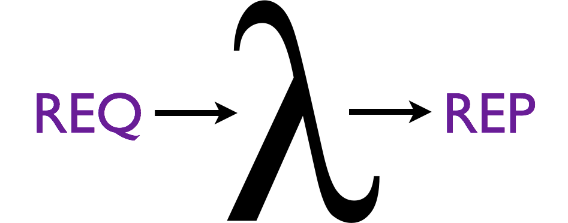
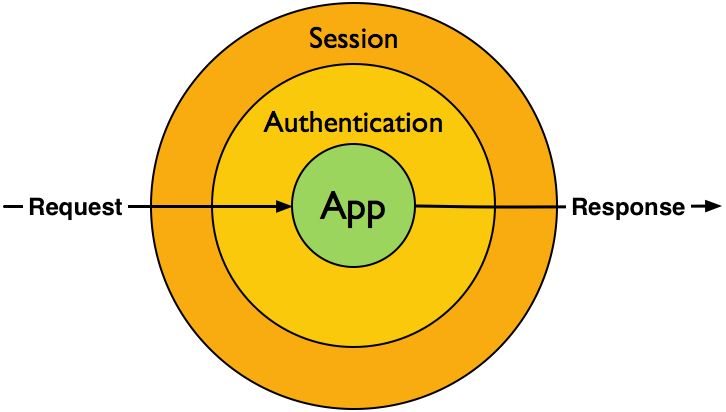

# Stack PHP

---

# HttpKernel

 
 

.fx: no-border

---

# What Is Stack?

A convention for composing HttpKernelInterface middlewares:

> [http://stackphp.com/](http://stackphp.com/)

.fx: no-border

---

# Implementation

    !php
    use Symfony\Component\HttpFoundation\Request;
    use Symfony\Component\HttpKernel\HttpKernelInterface;

    class MyStackMiddleware implements HttpKernelInterface
    {
        private $app;

        public function __construct(HttpKernelInterface $app)
        {
            $this->app = $app;
        }

        /**
         * {@inheritDoc}
         */
        public function handle(
            Request $request,
            $type = HttpKernelInterface::MASTER_REQUEST,
            $catch = true
        ) {
            // do something awesome

            return $this->app->handle($request, $type, $catch);
        }
    }
