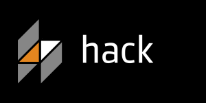

# Hack

---

# What Is Hack?

 

 

* 2004 - Facebook was initially built with PHP;
* 2009 - A PHP compiler called HipHop was released;
* 2010 - Minor changes to the PHP language were introduced by the HPHP team to
  improve development time and provide basic type safety. The changes were XHP
  and parameter type constraints;
* 2012 - Facebook engineering teams started exploring the idea of annotating
  return types. And the Hack language was born...

---

# What Is Hack?

**Hack** is a **programming language** for HHVM that interoperates seamlessly
with PHP. It has been created by Facebook. In general, anything you can write in
PHP, you can also write in Hack.

Hack reconciles the fast development cycle of PHP with the discipline provided by
**static typing**, while **adding many features** commonly found in other modern
programming languages such as
[**generics**](http://docs.hhvm.com/manual/en/hack.generics.php),
[**collections**](http://docs.hhvm.com/manual/en/hack.collections.php), and
[**nullable**](http://docs.hhvm.com/manual/en/hack.nullable.php).

It also provides built-in [asynchronous
programming](http://docs.hhvm.com/manual/en/hack.async.php).

> Official website: [hacklang.org](http://hacklang.org/)

---

# Getting Started

Use `<?hh` at the top of your file; you can also change `<?php` to `<?hh` in
existing PHP files, and your code will run just as before in HHVM.

Optionally name your file with the .hh extension to distinguish your Hack files
from your PHP files. Of course, you can keep the name of the file .php (or any
other extension that you use).

**Important:** Hack and HTML code do not mix.

### Example

    !php
    <?hh
    class MyClass {
        public function hello(): string {
            return 'Hello, World!';
        }
    }

    function f(MyClass $m): string {
        return $m->hello();
    }

---

# Type Annotations

    !php
    <?hh

    class AnnotatedClass {
        public int $x;
        private string $s;
        protected array $arr;
        public AnotherClass $ac;

        public function bar(string $str, bool $b): float {
            if ($b && $str === "Hi") {
                return 3.2;
            }

            return 0.3;
        }
    }

> [http://docs.hhvm.com/manual/en/hack.annotations.php](http://docs.hhvm.com/manual/en/hack.annotations.php)

---

# Generics

    !php
    <?hh

    class Box<T> {
        public T $value;

        public function __construct(T $v) {
            $this->value = $v;
        }
    }

> [http://docs.hhvm.com/manual/en/hack.generics.php](http://docs.hhvm.com/manual/en/hack.generics.php)

---

# Collections

Hack provides a unified collections framework including: `Vector`, `Map`, `Set`, `Pair`.

> [http://docs.hhvm.com/manual/en/hack.collections.php](http://docs.hhvm.com/manual/en/hack.collections.php)

---

# Nullable Types

`Nullable` allows any type to have `null` assigned and checked on it:

    !php
    <?hh

    function check_not_null(?int $x): int {
        if ($x === null) {
            return -1;
        } else {
            return $x;
        }
    }

> [http://docs.hhvm.com/manual/en/hack.nullable.php](http://docs.hhvm.com/manual/en/hack.nullable.php)
