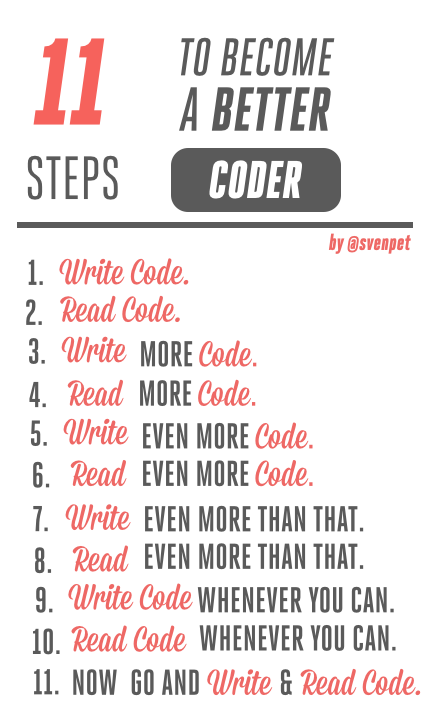

# Writing Better Code

---

# Agenda

* Coding Standards
* Programming To The Interface
* Dependency Inversion Principle (DIP)
* Dependency Injection (DI)
* Inversion of Control (IoC)
* Dependency Injection Container (DIC)
* Component Driven Development
* From STUPID to SOLID code!
* Object Calisthenics

---

# Coding Standards

    !php
    <?php

    namespace Vendor\Model;

    class Foo
    {
        const VERSION = '1.0';

        public $bar = null;

        protected $opts;

        private $var3 = 123;

        public function __construct(BarInterface $bar, array $opts = [])
        {
            $this->bar  = $bar;
            $this->opts = $opts;
        }
    }

> Read more about **coding standards** with
> [PSR-1](https://github.com/php-fig/fig-standards/blob/master/accepted/PSR-1-basic-coding-standard.md)
> and
> [PSR-2](https://github.com/php-fig/fig-standards/blob/master/accepted/PSR-2-coding-style-guide.md).

---

# PHP Coding Standards Fixer

The PHP Coding Standards Fixer tool fixes most issues in your code when
you want to follow the PHP coding standards as defined in the PSR-1 and
PSR-2 documents.

### Installation

    !bash
    $ wget http://cs.sensiolabs.org/get/php-cs-fixer.phar

### Usage

    !bash
    $ php php-cs-fixer.phar fix /path/to/dir/or/file

> More information at:
[http://cs.sensiolabs.org/](http://cs.sensiolabs.org/).

---

# Programming To The Interface

Reduces dependency on implementation specifics and makes code more reusable.

The `BananaController` can use either **Twig** or the raw PHP implementation
as template engine thanks to the `TemplateEngine` interface:

    !php
    interface TemplateEngine
    {
        /**
         * @param string $template
         * @param array  $parameters
         *
         * @return string
         */
        public function render($template, array $parameters = []);
    }

You should think about interfaces, not about internal implementation details.

---

# Dependency Inversion Principle (DIP)

The **D**ependency **I**nversion **P**rinciple has two parts:

* High-level modules should not depend on low-level modules. Both should depend
  on abstractions;
*  Abstractions should not depend upon details. Details should depend upon
  abstractions.

DIP is about the level of the abstraction in the messages sent from your code to
the thing it is calling.

---

# Dependency Injection (DI)

**D**ependency **I**njection is about how one object acquires a dependency.

    !php
    class Foo
    {
        private $bar;

        // **NOT** DI
        public function __construct()
        {
            $this->bar = new Bar();
        }
    }

When a dependency is provided externally, then the system is using DI:

    !php
    // DI!
    public function __construct(Bar $bar)
    {
        $this->bar = $bar;
    }

---

# Dependency Injection (Anti) Pattern

### ServiceLocator

The basic idea behind a service locator is to have an object that knows how to
get hold of all of the services that an application might need.

    !php
    class ServiceLocator
    {
        public static function getBar()
        {
            return new Bar();
        }
    }

    !php
    class Foo
    {
        private $bar;

        public function __construct()
        {
            $this->bar = ServiceLocator::getBar();
        }
    }

---

# Dependency Injection Patterns

### Constructor Injection

All dependencies are **injected** using a **constructor**:

    !php
    class Foo
    {
        private $bar;

        public function __construct(BarInterface $bar)
        {
            $this->bar = $bar;
        }
    }

---

# Dependency Injection Patterns

### Setter Injection

Dependencies are **injected** through **setters**:

    !php
    class Foo
    {
        private $bar;

        public function setBar(BarInterface $bar)
        {
            $this->bar = $bar;
        }
    }

---

# Dependency Injection Patterns

### Interface Injection

An interface describes the **injection**:

    !php
    interface BarAware
    {
        public function setBar(BarInterface $bar);
    }

It needs to be implemented by the class that wants to use a `BarInterface`:

    !php
    class Foo implements BarAware
    {
        private $bar;

        public function setBar(BarInterface $bar)
        {
            $this->bar = $bar;
        }
    }

---

# Inversion of Control (IoC)

**I**nversion **o**f **C**ontrol is about who initiates the call. If your code
initiates a call, it is not IoC, if the container/system/library calls back
into code that you provided it, it is IoC.

Hollywood Principle: _Don't call us, we'll call you_.

---

# Dependency Injection Container (DIC)

A framework or library for building graphs of objects by passing in (injecting)
each object's dependencies. Object lifetimes are handled by the container
instead of by the consuming object.

Most of the time, you rely on configuration files to describe your **classes**
and their **dependencies**. A **class** in this context is also known as a
**service**.

You ask this container to retrieve a service, and it is **lazy loaded** and
dynamically built:

    !php
    // It's an instance of `TemplateEngine`, but you don't know
    // anything about its internal implementation.
    // Is it the raw PHP implementation or Twig?
    $engine = $container->get('template_engine');

---

# PHP Implementations

### Twittee

[Twittee](https://github.com/fabpot/twittee) is the **smallest** Dependency Injection
Container written in PHP.
It fits in a _tweet_ (less than 140 characters):

    !php
    class Container
    {
        protected $s = array();

        function __set($k, $c)
        {
            $this->s[$k] = $c;
        }

        function __get($k)
        {
            return $this->s[$k]($this);
        }
    }

---

# PHP Implementations

### Pimple

[Pimple](https://github.com/fabpot/Pimple) is a small Dependency Injection Container
for PHP 5.3 that consists of just one file and one class.

### The Symfony2 DependencyInjection Component

The [DependencyInjection](https://github.com/symfony/DependencyInjection) component
allows you to standardize and centralize the way objects are constructed in your
application.

> Read more:
>
> * [http://symfony.com/doc/current/book/service_container.html](http://symfony.com/doc/current/book/service_container.html);
> * [http://symfony.com/doc/current/components/dependency_injection/](http://symfony.com/doc/current/components/dependency_injection/).

---

# Component Driven Development

It’s all about **Separation of Concerns** (SoC).

You design components with their own logic, each component does **one thing
well**, and **only one thing**.

How to manage these components in your application?

> Read more: [Component Driven Development: it's like
Lego!](http://williamdurand.fr/2012/02/01/component-driven-development-it-s-like-lego/)

---

# From STUPID to SOLID code! (1/2)

### STUPID

* **S**ingleton
* **T**ight Coupling
* **U**ntestability
* **P**remature Optimization
* **I**ndescriptive Naming
* **D**uplication

> Read more:
[http://williamdurand.fr/2013/07/30/from-stupid-to-solid-code/#stupid-code-seriously](http://williamdurand.fr/2013/07/30/from-stupid-to-solid-code/#stupid-code-seriously).

---

# From STUPID to SOLID code! (2/2)

### SOLID

* **S**ingle Responsibility Principle
* **O**pen/Closed Principle
* **L**iskov Substitution Principle
* **I**nterface Segregation Principle
* **D**ependency Inversion Principle

> Read more:
[http://williamdurand.fr/2013/07/30/from-stupid-to-solid-code/#solid-to-the-rescue](http://williamdurand.fr/2013/07/30/from-stupid-to-solid-code/#solid-to-the-rescue).

---

# Object Calisthenics

**9 rules** invented by Jeff Bay in his book [The ThoughWorks
Anthology](http://pragprog.com/book/twa/thoughtworks-anthology):

1. Only One Level Of Indentation Per Method
2. Don't Use The ELSE Keyword
3. Wrap All Primitives And Strings
4. First Class Collections
5. One Dot Per Line
6. Don't Abbreviate
7. Keep All Entities Small
8. No Classes With More Than Two Instance Variables
9. No Getters/Setters/Properties

> Read more:
[http://williamdurand.fr/2013/06/03/object-calisthenics/](http://williamdurand.fr/2013/06/03/object-calisthenics/).

---

  
