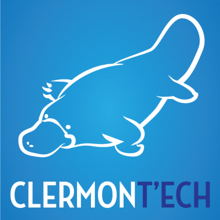

# Who Is Speaking?

---

# William DURAND

PhD student at Michelin / LIMOS

Graduated from IUT and ISIMA

Worked at:

* [Nelmio](http://nelm.io) (Zürich, Switzerland);
* [e-TF1](http://www.tf1.fr/) (Paris, France);
* [Prizee.com](http://prizee.com) (Clermont-Fd, France).

Open-Source evangelist:

* Lead developer of [Geocoder](http://geocoder-php.org/), and [several other
  projects](https://github.com/willdurand);
* (Inactive?) Contributor on Symfony.

    <i class="fa fa-twitter"></i> <a href="https://twitter.com/couac">twitter.com/couac</a>
    &nbsp;|&nbsp;
    <i class="fa fa-github"></i> <a href="https://github.com/willdurand">github.com/willdurand</a>
    &nbsp;|&nbsp;
    <i class="fa fa-globe"></i> <a href="http://www.williamdurand.fr">williamdurand.fr</a>

---

# [edu@drnd.me](mailto:edu@drnd.me)

---

# 
